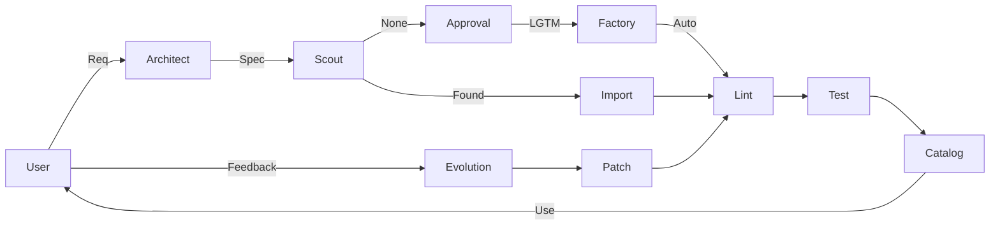

# Skill Factory

AIエージェントの「スキル」を製造、維持、配布するための標準化された工場です。
このリポジトリは「Skill Factory」手法の正本（Source of Truth）として機能します。

**運用ルール (厳守):**

- **摩擦ルール (Friction Rule)**: 一回限りのタスクのためにスキルを作らないでください。「2〜3回繰り返して摩擦を感じたら」スキル化します。（既存スキルのパッチを推奨）
- **まず調達 (Procurement First)**: **作る前に必ずスカウト (`skill_scout_web`) を走らせてください。**
- **品質保証 (Quality Assurance)**: **3つの受け入れテスト**がないスキルは「未完成」です。
- **ライフサイクル**: `deprecated` -> `removed` のステージに従ってください。
- **言語標準**: すべての対話と成果物は **日本語** で行ってください（憲法第7条）。

## 機能 (Capabilities)

| Skill                          | Description                          |
| :----------------------------- | :----------------------------------- |
| **Foundation (Requirements)**  |                                      |
| `skill_specificator_architect` | 設計士。曖昧な要望を仕様書にします。 |
| **Core**                       |                                      |
| `skill_factory_constitution`   | 憲法の番人。ルールを守らせます。     |
| `universal_skill_factory`      | 製造機。新しいスキルを作ります。     |
| `skill_linter_auditor`         | 検品係。コンプライアンスをチェック。 |
| `skill_catalog_curator`        | 司書。スキルを管理・検索します。     |
| **QA Loop**                    |                                      |
| `skill_test_generator`         | テスト作成係。受入テストを作ります。 |
| `evolution_log_capturer`       | 記録係。失敗ログを記録します。       |
| `skill_patch_proposer`         | 修理係。ログを元にパッチを当てます。 |
| **Self-Improvement**           |                                      |
| `factory_kaizen_architect`     | 工場自体の改善を提案します。         |
| `skill_chain_simulator`        | スキルの連携テストを行います。       |
| `skill_dependency_visualizer`  | 工場の全体図を描画します。           |
| **Distribution**               |                                      |
| `packager_readme_writer`       | 取説係。READMEを書きます。           |
| `job_pack_composer`            | 出荷係。パックをエクスポートします。 |
| **Procurement**                |                                      |
| `skill_scout_web`              | スカウト。既存スキルを探します。     |
| `skill_import_intake`          | 税関。外部スキルを取り込みます。     |

## クイックスタート (Quickstart)

1.  **設計 (Spec)**: `skill_specificator_architect "グラフ描画スキルが欲しい"`
2.  **探索 (Scout)**: `skill_scout_web "グラフ描画ライブラリ"`
3.  **製造 (Create)**: `universal_skill_factory "仕様書に基づき製造せよ"`
4.  **検査 (Inspect)**: 自動的に `skill_linter_auditor` と `skill_test_generator` が走ります。

## 製造ライン (Factory Line)

## 貢献 (Contributing)

`docs/SKILL_FACTORY_CONSTITUTION.md` を参照してください。
フロー: 設計 -> 承認 -> 製造 -> 検査 -> PR。

## License

MIT
