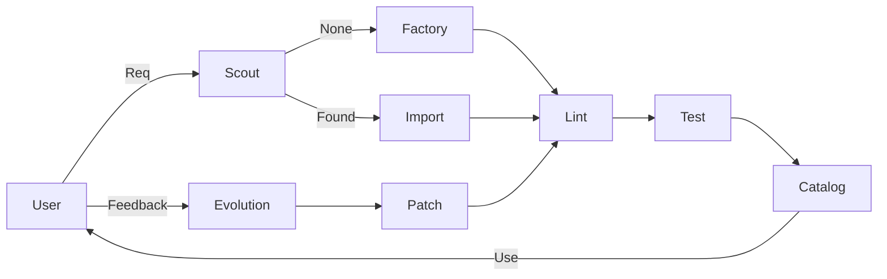

# Skill Factory

A standardized factory for manufacturing, maintaining, and distributing AI Agent Skills.
This repository acts as the source of truth for the "Skill Factory" methodology.

**OPERATIONAL RULES (STRICT):**

- **Friction Rule**: Do not create skills for one-off tasks. **Friction 2-3 times -> New Skill.** (Prefer patching existing).
- **Procurement First**: **Always run Scout (`skill_scout_web`) before creating.**
- **Quality Assurance**: A skill is "Unfinished" without **3 Acceptance Tests**.
- **Lifecycle**: Follow `deprecated` -> `removed` stages.

## Capabilities

| Skill                        | Description                       |
| :--------------------------- | :-------------------------------- |
| **Core**                     |                                   |
| `skill_factory_constitution` | The Guardian of the Rules.        |
| `universal_skill_factory`    | The Creator. Makes new skills.    |
| `skill_linter_auditor`       | The Inspector. Checks compliance. |
| `skill_catalog_curator`      | The Librarian. Finds skills.      |
| **QA Loop**                  |                                   |
| `skill_test_generator`       | Creates tests.                    |
| `evolution_log_capturer`     | Records why a skill failed.       |
| `skill_patch_proposer`       | Fixes skills based on logs.       |
| **Self-Improvement**         |                                   |
| `factory_kaizen_architect`   | Proposes new skills for Factory.  |
| **Distribution**             |                                   |
| `packager_readme_writer`     | Writes public docs.               |
| `job_pack_composer`          | Bundles for export.               |
| **Procurement**              |                                   |
| `skill_scout_web`            | Finds existing skills.            |
| `skill_import_intake`        | Ingests external skills.          |

## Quickstart

1.  **Scout**: `skill_scout_web "I need a graph plotter"`
2.  **Create**: `universal_skill_factory "Create a graph plotter skill"`
3.  **Lint/Test**: `skill_linter_auditor` -> `skill_test_generator`

## Factory Line

## Contributing

See `docs/SKILL_FACTORY_CONSTITUTION.md`.
Flow: Scout -> Create -> Test -> PR.

## LicenseMIT
