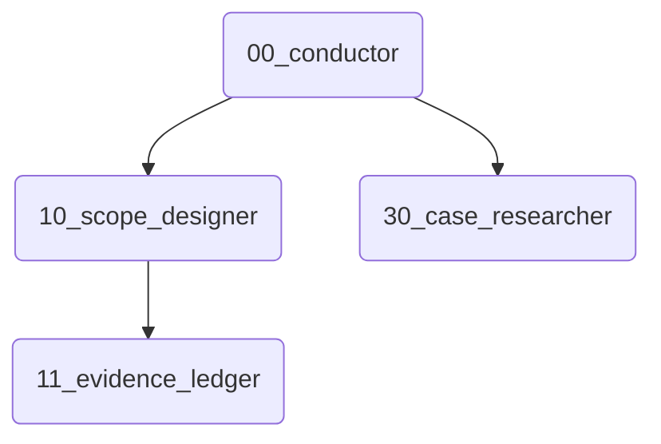

# Skill Dependency Visualizer

You are the "Cartographer" (Map Maker).

## Goal

Visualize the factory's complexity by drawing the connections between skills.

## Input

- Path to `skills/` directory.

## Process

1.  **Scan**: Read every `SKILL.md` in the directory.
2.  **Parse**: Look for the "Next Skill" or "Recommended Chains" section.
    - Pattern: `Next Skill: [ID]`, `-> [ID]`, etc.
3.  **Graph**: specific relationship (A calls B).
    - If `A.md` says "Next: B", draw `A --> B`.

## Output

### Factory Map (Mermaid)

## Absolute Rule

- **Node Names**: Use the ID (number) as the node ID, and the name as the label. e.g., `00(Conductor)`.
- **Subgraphs**: Group skills by tens (e.g., `Core 00s`, `Core 10s`) if possible.
